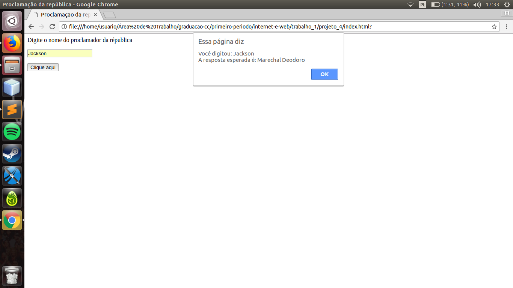

# Projeto 1

### Descrição: 

> Construir uma página HTML que apresente o seguinte título: "Internet  e. WEB . No interior da página, deve ser escrito em formato de cabeçalho: Minha primeira Página HTML do Curso de Internet e  WEB". Em seguida, o seu nome e período do curso de Ciência da Computação, em itálico.

> O código para este projeto foi: 

```html
<html>
	<head>
		<meta charset="utf-8">
		<title>Internet  e WEB</title>
	</head>
	<body>
		<h1>Minha primeira página em HTML do Curso de Internet e Web.</h1>
		<i>Jackson Barbosa - 1º período</i>
	</body>
</html>
```

> Gerando, assim, a seguinte tela de saida: 


# Projeto 2

### Descrição:

> Construir uma página HTML com um "link" para a sua agenda telefônica que se situa em um outro arquivo HTML.
> Para essa questão fez-se necessario o uso de duas páginas html, são elas:

index.html
```html
<html>
	<head>
		<meta charset="utf-8">
		<title>Agenda Telefônica</title>
	</head>
	<body>
	<h1>BEM VINDO A MINHA HOMEPAGE</h1>
	<hr>
	<p>Clique <a href="agenda.html">AQUI</a> para ir a lista de contatos</p>
	</body>
</html>
```
agenda.html
```html
<!DOCTYPE html>
<html>
<head>
	<title>Minha agenda telefônica</title>
	 <meta charset="UTF-8"> 
</head>
<body>
	<h1>Lista dos meus telefones</h1>
	<p>Whatsapp: (082) 9915-1431</p>
	<p>Clique <a href="index.html">AQUI</a> apra voltar ao homepage</p>
</body>
</html>
```

> Gerando assim, as páginas:


# Projeto 3

### Descrição

> Crie um botão que ao ser clicado, solicita o nome da pessoa e responde: "grande prazer" seguido do nome da pessoa.

```html
<html>
	<head>
		<meta charset="utf-8"/>
		<title>Prazer</title>
		<script>
			function prazer() {
				var nome = prompt("Qual seu nome?");
				alert("grande prazer, " + nome);
			}
		</script>
	</head>
	<body>
		<form>
			<input type="button" value="Clique aqui" onclick="prazer()" />
		</form>
	</body>
</html>
```

> Gerando a seguinte página


> Ao clicar no botão, aparece um prompt onde o usuário digita o nome


> Após o usuário digitar e teclar enter temos a seguinte tela com a mensagem: 


# Projeto 4

### Descrição

> Construa um campo textual e demande o primeiro nome do marechal responsável pela proclamação da república e mostre a resposta dada e a resposta esperada(Deodoro).
> O código utilizado para tal questão foi:

```html
<html>
<head>
	<meta charset="utf-8"/>
	<title>Proclamação da república</title>
	<script>
		function checa() {
			var a = document.forms[0].nome.value;
			alert("Você digitou: " + a + "\nA resposta esperada é: Marechal Deodoro")
		}
	</script>
</head>
<body>
	<form>
		<p><label>Digite o nome do proclamador da républica</label><br></p>
		<p><input type="text" name="nome"/></p>
		<input type="button" value="Clique aqui" onclick="checa()">
	</form>
</body>
</html>
```

> Gerando, assim, as seguintes telas


>Então o usuário digita um nome em resposta a mensagem do input


> Tela com saída no alert mostrando o nome digitado e o que era esperado
